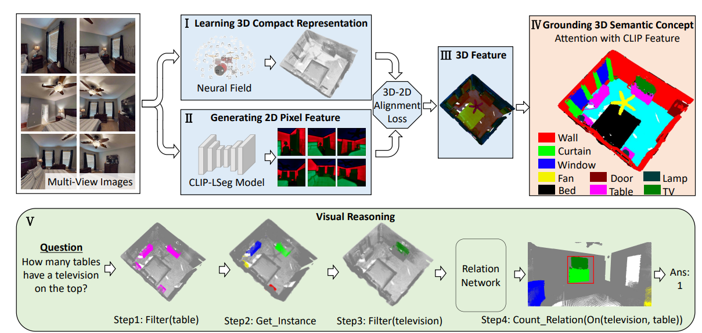

> # [CVPR 2023] 3D Concept Learning and Reasoning From Multi-View Images <br>
> [Paper](https://arxiv.org/abs/2303.11327)



## Installation

The whole pipeline contains three steps to obtain the 3D feature of a room. The first 
step is using [LSeg](https://arxiv.org/abs/2201.03546) to obtain features for multi-view 2D images.
The second and third steps are using a NeRF-based model [DVGO](https://arxiv.org/abs/2111.11215) to map the 2D features to 3D.

We recommend using different virtual environment for the first step and the second & third steps. 

For the first step:

```
conda create -n lseg python=3.8
conda activate lseg
cd LSeg
pip install -r requirements.txt
```
Or follow the guidance in the official repository of LSeg in https://github.com/isl-org/lang-seg.


Similarly, for the second & third steps (these two steps share the same virtual environment):

```
conda create -n dvgo python=3.8
conda activate dvgo
cd DVGO
pip install -r requirements.txt
```
Or follow the guidance in the official repository of DVGO in https://github.com/sunset1995/DirectVoxGO.

## Dataset

TODO

Dataset structure:
```
datadir
  - 00009-vLpv2VX547B_0    # most rooms contain 1000 views while some contain less
     - 0.png
     - 0_depth.npy
     - 0.json
     - 1.png
     - 1_depth.npy
     - 1.json
     ...
  - 00009-vLpv2VX547B_1
     - 0.png
     - 0_depth.npy
     - 0.json
     - 1.png
     - 1_depth.npy
     - 1.json
     ...
  ... 
  - 00891-cvZr5TUy5C5_9
     - 0.png
     - 0_depth.npy
     - 0.json
     - 1.png
     - 1_depth.npy
     - 1.json
     ...
```


## Training

### First Stage

Run the command (take room "00009-vLpv2VX547B_1" as an example):

```
conda activate lseg
cd LSeg
python run_lseg.py --room_name 00009-vLpv2VX547B_1 > logs/00009-vLpv2VX547B_1.log
```

Afterwards, the extracted 2D features for multi-view images will be stored in the directory "00009-vLpv2VX547B_1_result"
under the same "datadir" directory of all the data.

### Second Stage

Run the command (take room "00009-vLpv2VX547B_1" as an example):

```
conda activate dvgo
cd DVGO
python run.py --config configs/custom/00009-vLpv2VX547B_1.py
```

Afterwards, the checkpoints will be stored in the log directory defined in the configuration file "./DVGO/configs/custom/default_ubd_inward_facing.py".

### Third Stage

Run the command (take room "00009-vLpv2VX547B_1" as an example):

```
conda activate dvgo
cd DVGO_feature
python run.py --config configs/custom/00009-vLpv2VX547B_1.py
```

Afterwards, the checkpoints and the rendered 3D feature for this room will be stored in the directory defined in the configuration file "./DVGO_feature/configs/custom/default_ubd_inward_facing.py".
It is recommended that the log directory of the two configuration files in the second & third stages are the same. It will be easier to manage the experimental results.


## Citation
If you find our work useful, please consider citing:
```BibTeX
@inproceedings{cvpr23_3dclr,
    author    = {Hong, Yining and Lin, Chunru and Du, Yilun and Chen, Zhenfang and Tenenbaum, Joshua B. and Gan, Chuang},
    title     = {3D Concept Learning and Reasoning From Multi-View Images},
    booktitle = {IEEE/CVF Conference on Computer Vision and Pattern Recognition (CVPR)},
    year      = {2023},
}
```

### Acknowledgement
The codes are largely borrowed from the LSeg and DVGO:

https://github.com/isl-org/lang-seg

https://github.com/sunset1995/DirectVoxGO

Thanks the authors for sharing the code implementation.